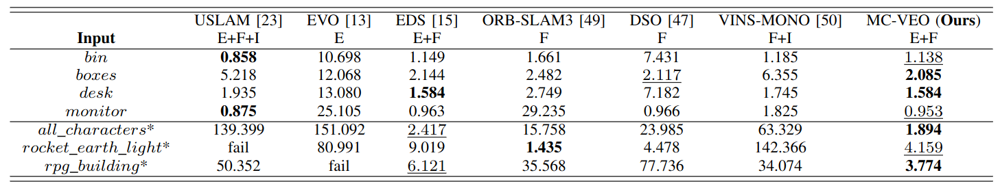
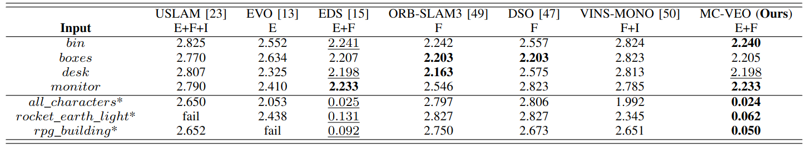

## MC-VEO: A Visual-Event Odometry with Accurate 6-DoF Motion Compensation

Jiafeng Huang1, Lin Zhang1, Tianjun Zhang1, Shengjie Zhao1

1School of Software Engineering, Tongji University, Shanghai, China

### Introduction

>  This is the website for our paper MC-VEO: A Visual-Event Odometry with Accurate 6-DoF Motion Compensation.

### MC-VEO

Table 1. ATEs of MC-VEO and other classical VOs.

Table 2. Rotation Errors of MC-VEO and other classical VOs.

>  Considering all metrics comprehensively, the performence of the MC-VEO is the best among all compared schemes.

### Demo Videos

The following is the demo video demonstrating the performance of our MC-VEO. 

<video src="bin.mp4" width="600" height="450" controls preload></video><video src="desk.mp4" width="600" height="450" controls preload></video>
<video src="all_characters.mp4" width="600" height="450" controls preload></video><video src="rocket_earth_light.mp4" width="600" height="450" controls preload></video>

### Source Codes

[MC-VEO](https://github.com/huangfeng95/mc-veo-buildconf)
